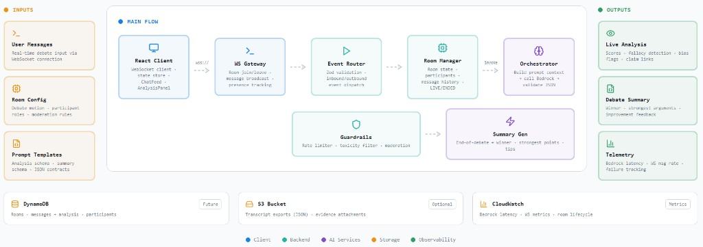

# ArguLens — AI Debate Engine

A real-time debate platform where two speakers argue live and an AI judge scores argument quality, flags logical fallacies and bias, extracts claims with evidence links, and produces a full debate summary when the round ends.

## What It Does

ArguLens creates live debate rooms where participants take on roles — Speaker A, Speaker B, or Audience — and argue a motion in real time. As each message is sent, an AI judge powered by AWS Bedrock analyzes the argument and returns:

- **Logic Score (0–100)** — How well-structured and evidence-backed the argument is
- **Persuasion Score (0–100)** — How compelling and responsive the argument is
- **Fallacy Detection** — Identifies logical fallacies (ad hominem, strawman, false dilemma, slippery slope, etc.) with severity ratings and suggested rewrites
- **Bias Detection** — Flags loaded language, stereotyping, absolutist language, and framing bias with neutral alternatives
- **Claim Extraction** — Pulls out discrete claims with pro/con/neutral stance and supporting evidence snippets quoted directly from the message
- **Claim Linking** — Maps relationships between claims across messages (supports, attacks, rebuts)

When the debate ends, the AI produces a comprehensive summary including the winner, strongest points per side, improvement tips for each speaker, and the most common fallacies observed.

## How It Works

### Architecture



1. **Users connect** to a WebSocket server and create or join a debate room using a room code
2. **Speakers send messages** which are broadcast instantly to all participants
3. **Each message triggers AI analysis** — the server sends the message + recent context to AWS Bedrock, which returns structured JSON with scores, fallacies, bias flags, and extracted claims
4. **Analysis results are broadcast** to all room participants and rendered alongside the original messages
5. **When the debate ends**, the full transcript is sent to Bedrock for a comprehensive summary with winner determination, strongest arguments, and coaching feedback

### User Flow

1. **Create or Join** — Enter your name and either create a new room with a debate motion or join an existing room with a code
2. **Pick a Role** — Choose Speaker A, Speaker B, or Audience (only one of each speaker role allowed)
3. **Debate Live** — Speakers type arguments in real time; everyone sees messages with AI score badges as analysis arrives
4. **Review Analysis** — Click any message to see detailed breakdowns: score bars, fallacy cards with quotes and suggestions, bias flags with neutral rewrites, and extracted claims with evidence
5. **Explore the Rhetorical Map** — View all claims grouped by speaker with supports/attacks/rebuts relationships; click a claim to scroll to its source message
6. **End the Debate** — Get a full AI summary with winner, strongest points per side, improvement tips, and common fallacies
7. **Export** — Download the full transcript with all analysis as a JSON file

### WebSocket Events

| Client → Server | Server → Client |
|---|---|
| `CREATE_ROOM` | `ROOM_CREATED` |
| `JOIN_ROOM` | `ROOM_JOINED` |
| `SET_ROLE` | `ROOM_STATE` |
| `SEND_MESSAGE` | `MESSAGE_RECEIVED` |
| `END_DEBATE` | `ANALYSIS_RESULT` |
| `REWRITE_NEUTRAL` | `DEBATE_ENDED` |
| | `DEBATE_SUMMARY` |
| | `REWRITE_RESULT` |
| | `ERROR` |

### AI Scoring Rubric

**Logic Score** is built from:
- Clarity of claim (specific vs vague)
- Presence of reasoning (because/therefore chains)
- Evidence usage (facts and examples vs unsupported assertions)
- Relevance to the debate motion
- Coherence (no internal contradictions)

**Persuasion Score** is built from:
- Confidence and clarity of expression
- Emotional appeal without manipulation
- Argument structure (claim → reason → evidence)
- Responsiveness to the opponent's points

## Tech Stack

### Frontend
- **React 19** — UI framework
- **Vite 7** — Build tool and dev server
- **React Router 7** — Client-side routing (`/` home, `/room/:roomId` debate room)

### Backend
- **Node.js** with ES modules
- **Express 5** — HTTP server (health check endpoint)
- **ws** — WebSocket server for real-time communication
- **Zod 4** — Runtime validation of all WebSocket payloads and AI responses
- **nanoid** — Room and message ID generation
- **dotenv** — Environment configuration
- **cors** — Cross-origin request handling

### AI
- **AWS Bedrock** — Managed AI inference
- **Claude 3.5 Sonnet** — Language model for argument analysis, scoring, and summary generation
- **Structured JSON prompting** — All AI responses are validated against strict Zod schemas with safe fallbacks

### Data
- In-memory storage (MVP) — rooms, participants, messages, and analysis results stored in `Map` objects
- Client-side JSON export for transcript persistence

## Project Structure

```
ArguLens-1/
├── client/                     # React frontend
│   └── src/
│       ├── components/
│       │   ├── AnalysisPanel.jsx    # Tabbed analysis detail view
│       │   ├── ChatFeed.jsx         # Live message stream with score badges
│       │   ├── MessageInput.jsx     # Text input for speakers
│       │   ├── RhetoricalMap.jsx    # Claims index with relationship edges
│       │   ├── RolePicker.jsx       # Speaker A/B/Audience selector
│       │   └── SummaryModal.jsx     # End-of-debate results overlay
│       ├── lib/
│       │   └── ws.js                # WebSocket client (connect, send, subscribe, reconnect)
│       ├── pages/
│       │   ├── Home.jsx             # Create/join room UI
│       │   ├── Room.jsx             # Main debate room page
│       │   └── Room.css             # All room + component styles
│       └── App.jsx                  # Router setup
├── server/                     # Node.js backend
│   ├── src/
│   │   ├── index.js                 # Express + WebSocket server, event routing
│   │   ├── rooms.js                 # In-memory room state management
│   │   ├── schemas.js               # Zod schemas for client event payloads
│   │   ├── analysisSchema.js        # Zod schema for per-message AI analysis
│   │   ├── summarySchema.js         # Zod schema for end-of-debate summary
│   │   ├── prompt.js                # Per-message analysis prompt builder
│   │   ├── summaryPrompt.js         # End-of-debate summary prompt builder
│   │   └── bedrock.js               # AWS Bedrock client (analysis + summary)
│   └── .env                         # Environment config (PORT, AWS_REGION, MODEL_ID)
└── README.md
```

## Getting Started

### Prerequisites

- Node.js 18+
- AWS account with Bedrock access and Claude 3.5 Sonnet enabled
- AWS credentials configured locally (`~/.aws/credentials` or environment variables)

### Setup

```bash
# Clone the repository
git clone <repo-url>
cd ArguLens-1

# Install server dependencies
cd server
npm install

# Configure environment
# Edit server/.env with your AWS region and Bedrock model ID

# Install client dependencies
cd ../client
npm install
```

### Run

```bash
# Terminal 1 — Start the server
cd server
npm start
# Server listening on http://localhost:8080

# Terminal 2 — Start the client
cd client
npm run dev
# Client running on http://localhost:5173
```

Open two browser tabs to `http://localhost:5173` to simulate a two-speaker debate.

## Features

### MVP (Implemented)
- Live WebSocket debate rooms with room codes
- Role-based access (Speaker A, Speaker B, Audience)
- Per-message AI analysis with logic and persuasion scores
- Fallacy detection with severity, explanations, and suggested rewrites
- Bias detection with neutral rewrite suggestions
- Claim extraction with evidence snippets
- Rhetorical map with claim relationships and edge filtering
- End-of-debate AI summary with winner, coaching tips, and quality score
- "Rewrite Neutrally" button for biased messages
- JSON transcript export
- 2-second rate limiting per speaker
- Auto-reconnecting WebSocket client

### Stretch (Future)
- Visual graph rendering (React Flow / D3) for the rhetorical map
- Audience live voting and persuasion momentum graph
- Debate mode rubrics (high school vs policy debate)
- Anti-toxicity guardrails with harmful language highlighting
- DynamoDB persistence and S3 transcript storage
- User authentication and debate history
